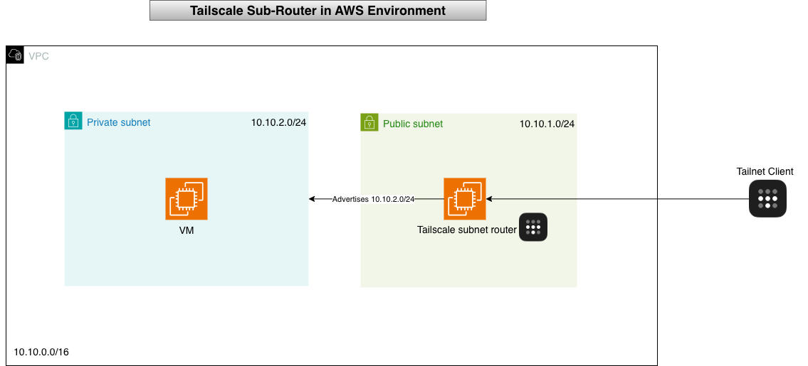

# Tailscale Subnet Router Demo on AWS (Terraform + GitOps)

This repository demonstrates how to deploy a **Tailscale Subnet Router** on **AWS using Terraform**, following **production-ready patterns**.

---

## Deployment resources

| Component              | Purpose                              |
| ---------------------- | ------------------------------------ |
| Public EC2             | Acts as **Tailscale Subnet Router**  |
| Private EC2            | Reachable only via Tailscale         |
| VPC + Subnets          | Network infrastructure               |
| SGs                    | Security groups (ICMP/TCP allowed)   |
| IAM Roles              | Least-privilege Terraform + EC2      |
| AWS Secrets Manager    | Stores Tailscale auth key            |
| S3 + DynamoDB          | Terraform remote backend             |
| GitHub OIDC (optional) | CI/CD without static AWS credentials |

After deploy, you can:

- `tailscale ping` and `ssh` into **private EC2 (no public IP)**
- Validate **advertise-routes functionality**
- Prove **zero-trust connectivity**

---

## How It Works (High-Level)

1. Public EC2 joins your Tailnet.
2. It advertises AWS subnet (example: `10.10.2.0/24`) to Tailscale.
3. Tailscale distributes this route.
4. All Tailnet devices can access the private EC2 securely.

## 💡 Use cases: replace VPNs, cross-cloud access, secure internal connectivity.



---

## 🔑 Prerequisites

### AWS

- AWS Account
- IAM permissions: EC2 / VPC / IAM / SecretsManager / S3 / DynamoDB
- AWS CLI configured (`aws configure`)

### Local

- Terraform `>=1.5`
- Git
- Tailscale account (Admin)

### Tailscale Auth Key

Create at: **Admin → Settings → Keys**

| Setting   | Value             |
| --------- | ----------------- |
| Reusable  | ON                |
| Ephemeral | OFF (recommended) |

---

## Pre-Terraform AWS Setup

```bash
# S3 backend
aws s3api create-bucket \
  --bucket ts-demo-backend-bucket \
  --region ca-central-1 \
  --create-bucket-configuration LocationConstraint=ca-central-1

# DynamoDB state locking
aws dynamodb create-table \
  --table-name ts-demo-tf-lock \
  --attribute-definitions AttributeName=LockID,AttributeType=S \
  --key-schema AttributeName=LockID,KeyType=HASH \
  --billing-mode PAY_PER_REQUEST

# Store Tailscale auth key to secret
aws secretsmanager update-secret \
  --secret-id ts-aws-demo-tailscale-auth \
  --secret-string "tskey-auth-xxxx" \
  --region ca-central-1
```

## Deployment Steps

### Step 1: Clone repo

```
git clone https://github.com/AshminPy/tailscale-se-demo.git
cd tailscale-se-demo
```

### Step 2: Go to AWS environment

```
cd envs/aws
```

### Step 3: Initialize Terraform (uses S3/DynamoDB backend)

```
terraform init
```

### Step 4: Review plan

```
terraform plan
```

### Step 5: Apply

```
terraform apply -auto-approve
```

## Verification

### 1. Confirm subnet router is visible

```
tailscale status
```

### 2. Ping private EC2

```
tailscale ping 10.10.2.10
```

### 3. SSH via Tailscale

```
ssh ubuntu@10.10.2.10
```

Success = routing active, advertise-routes working, private EC2 accessible.

## Cleanup

```
cd envs/aws
terraform destroy -auto-approve
```

### (Optional) delete secret

```
aws secretsmanager delete-secret --secret-id ts-aws-demo-tailscale-auth
```

## Reference

https://tailscale.com/kb/1019/subnets
